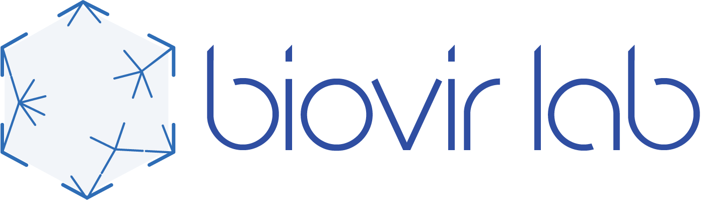
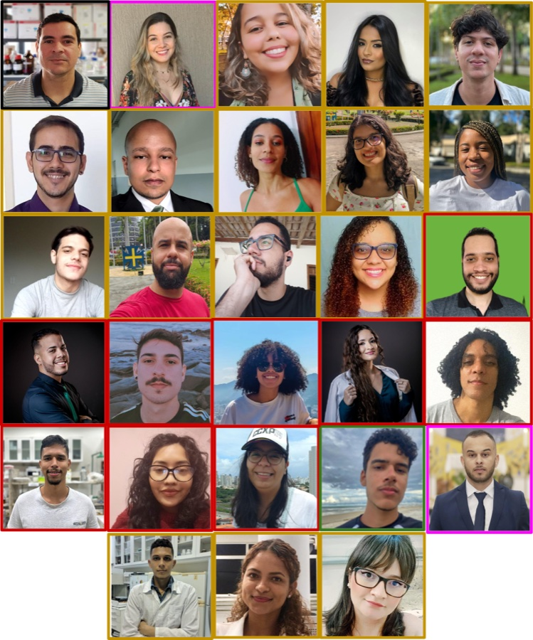

## Roteiro {.smaller}

::: {.columns}
::: {.column width="55%"}
1. Contexto e pergunta
2. Materiais e métodos
3. Resultados
4. Discussão
5. Próximos passos
:::

::: {.column width="45%"}
::: {.destaque}
**Mensagem principal**

Uma frase que resume o que a plateia deve levar embora se esquecer
todo o resto.
:::
:::
:::

# Contexto {.divisor background-color="#304ea1"}

## O problema

- Primeiro ponto do contexto
- Segundo ponto, com um termo [importante]{.marca}
- Terceiro ponto

::: {.destaque}
**Pergunta de pesquisa:** o que exatamente este trabalho tenta responder?
:::

## Números que situam o problema

::: {.columns}
::: {.column width="33%"}
::: {.numero}
### 1.245
amostras analisadas
:::
:::

::: {.column width="33%"}
::: {.numero}
### 87%
cobertura média
:::
:::

::: {.column width="33%"}
::: {.numero}
### 12
genomas novos
:::
:::
:::

# Materiais e métodos {.divisor background-color="#304ea1"}

## Desenho do estudo

::: {.cartoes}
::: {.cartao}
#### 1. Coleta
Origem das amostras, período e critérios de inclusão.
:::

::: {.cartao}
#### 2. Sequenciamento
Plataforma, química e profundidade alvo.
:::

::: {.cartao}
#### 3. Análise
Pipeline, versões e parâmetros principais.
:::
:::

## Pipeline computacional

```bash
# Controle de qualidade e montagem
fastp -i amostra_R1.fq.gz -I amostra_R2.fq.gz \
      -o limpo_R1.fq.gz  -O limpo_R2.fq.gz

spades.py --meta -1 limpo_R1.fq.gz -2 limpo_R2.fq.gz -o montagem/
```

::: {.legenda}
Versões: fastp 0.23.4 · SPAdes 3.15.5 · executado em 32 threads.
:::

# Resultados {.divisor background-color="#304ea1"}

## Resultado principal

::: {.columns}
::: {.column width="58%"}
{.moldura width="100%"}

::: {.legenda}
Figura 1. Substitua por seu gráfico. Legenda em uma ou duas linhas.
:::
:::

::: {.column width="42%"}
### O que a figura mostra

- Observação 1
- Observação 2
- Observação 3

::: {.caixa}
Detalhe metodológico que a plateia costuma perguntar.
:::
:::
:::

## Tabela resumo

| Grupo    | n   | Cobertura | Identidade |
|----------|----:|----------:|-----------:|
| Controle | 120 |     94,2% |      99,1% |
| Teste A  |  98 |     88,7% |      97,4% |
| Teste B  | 105 |     91,3% |      98,0% |

::: {.legenda}
Valores medianos. Cobertura calculada sobre o genoma de referência.
:::

# Discussão {.divisor background-color="#304ea1"}

## Interpretação

::: {.incremental}
- O que os resultados sustentam
- O que eles **não** sustentam
- Como se comparam à literatura
:::

. . .

::: {.destaque-forte}
Conclusão em uma frase, escrita para ser lembrada.
:::

## Limitações e próximos passos

::: {.columns}
::: {.column width="50%"}
#### Limitações

- Tamanho amostral
- Viés de coleta
- Resolução do método
:::

::: {.column width="50%"}
#### Próximos passos

- Validação experimental
- Ampliação da coorte
- Submissão do manuscrito
:::
:::

## Apoio {.smaller}

- Agências de fomento: CNPq, CAPES, FACEPE
- Colaboradores externos
- Participantes do estudo

::: {.legenda}
Contato: email@instituicao.br · github.com/biovirlab
:::

<!--
  SLIDE DE AGRADECIMENTOS
  Para atualizar a equipe, basta editar a lista de nomes abaixo:
  um "- " por pessoa. As duas colunas se reequilibram sozinhas.
-->

## Agradecimentos {.agradecimentos}

::: {.columns}
::: {.column width="56%"}
::: {.nomes}
- Eric Roberto Guimarães Rocha Aguiar
- Aijalon Brito da Silva Junior
- Amanda Gabrielly Santana Silva
- Anderson Carvalho Vieira
- Brenaráise Freitas Martins dos Santos
- Brunno Santos Mosquito de Souza
- Carlos Henrique de Carvalho Neto
- David Gabriel do Nascimento Souza
- Evelyn dos Santos Silva
- Gabriel Victor Pina Rodrigues
- Giulia Verpa Narciso Ribeiro
- Henrique Andrade Rabelo Bomfim
- Hermanna Vanesca Viana de Oliveira
- Jessica Fernandes Padre
- Joannan Lima Silva
- João Pedro Nunes Santos
- Joel Augusto Moura Porto
- Jonatha dos Santos Silva
- Laiana Pinheiro de Lima
- Lara Beatriz C. Moreira de Vasconcelos
- Leyla Katiuska Martel Solis
- Lixsy Celeste Bernardez Orellana
- Lucas Barbosa de Amorim Conceição
- Lucas Diego Mota Meneses
- Lucas Yago Melo Ferreira
- Paula Luize Camargos Fonseca
- Sabrina Ferreira de Santana
- Tatyana Chagas Moura
:::
:::

::: {.column width="44%"}
::: {.foto-equipe}

:::
:::
:::
