#  Contexto Geral {.divisor background-color="#304ea1"}

## Perfis de trabalhos publicados no Lab

```{r}
#| label: rede-virus-bioinfo
#| echo: false
#| fig-cap: "Rede de termos recorrentes nos artigos do Virus Bioinformatics Laboratory (UESC)"

library(visNetwork)

nodes <- data.frame(
  id = 1:21,
  label = c(
    "metagenômica\nviral",
    "métodos e\nferramentas", "tipos de\nvírus",
    "hospedeiros e\nambientes", "abordagens\nde dados",
    "ViralQuest", "pipeline", "HMM / perfis HMM", "ORF / RVDB", "LLM / IA",
    "vírus de RNA", "viromas", "vírus de insetos", "arbovírus", "novos vírus",
    "cacau (T. cacao)", "Mata Atlântica", "polinizadores", "controle biológico",
    "metatranscriptômica", "RNAi / small RNA"
  ),
  group = c(
    "centro",
    "metodos", "virus", "hospedeiros", "dados",
    "metodos", "metodos", "metodos", "metodos", "metodos",
    "virus", "virus", "virus", "virus", "virus",
    "hospedeiros", "hospedeiros", "hospedeiros", "hospedeiros",
    "dados", "dados"
  ),
  value = c(30, 18, 18, 18, 18, rep(10, 16)),
  stringsAsFactors = FALSE
)

edges <- data.frame(
  from = c(1, 1, 1, 1,
           2, 2, 2, 2, 2,
           3, 3, 3, 3, 3,
           4, 4, 4, 4,
           5, 5),
  to = c(2, 3, 4, 5,
         6, 7, 8, 9, 10,
         11, 12, 13, 14, 15,
         16, 17, 18, 19,
         20, 21)
)

visNetwork(nodes, edges, width = "100%", height = "600px") |>
  visGroups(groupname = "centro",      color = list(background = "#D3D1C7", border = "#5F5E5A"), font = list(size = 22)) |>
  visGroups(groupname = "metodos",     color = list(background = "#CECBF6", border = "#534AB7")) |>
  visGroups(groupname = "virus",       color = list(background = "#9FE1CB", border = "#0F6E56")) |>
  visGroups(groupname = "hospedeiros", color = list(background = "#F5C4B3", border = "#993C1D")) |>
  visGroups(groupname = "dados",       color = list(background = "#B5D4F4", border = "#185FA5")) |>
  visNodes(shape = "dot", font = list(size = 16, face = "sans")) |>
  visEdges(color = list(color = "#B4B2A9", highlight = "#5F5E5A"), smooth = FALSE) |>
  visPhysics(solver = "forceAtlas2Based",
             forceAtlas2Based = list(gravitationalConstant = -60),
             stabilization = TRUE) |>
  visInteraction(dragNodes = TRUE, zoomView = TRUE, navigationButtons = FALSE) |>
  visLayout(randomSeed = 42)
```

## Metodologias de Bioinformática

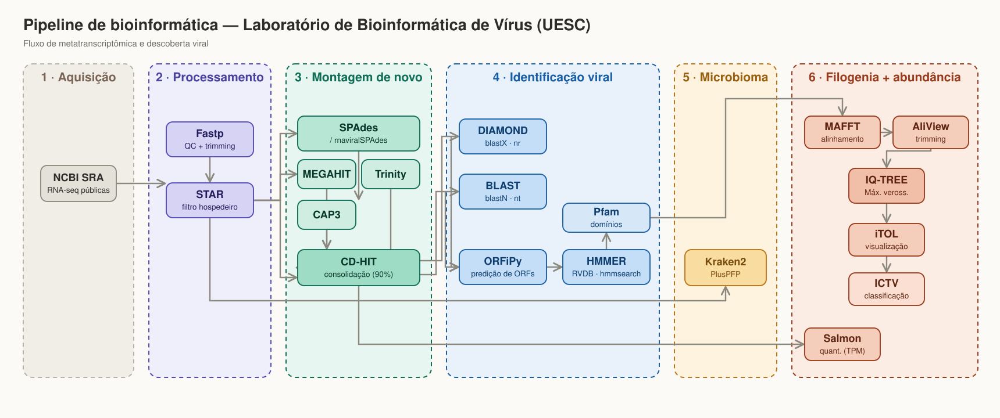{.moldura}

## Benefícios e Limitações da Metodologia


::: {.cartoes}
::: {.cartao}
#### Fácil Acesso
Os dados estão públicos, com paciência e aprendizado qualquer um pode processá-los.
:::
::: {.cartao}
#### Celeridade
O ritmo dos trabalhos de bioinformática é bem mais rápido que estudos *in vitro*.
:::

::: {.cartao style="--cor: #d81010"}
#### Dados não inéditos
Dados em bancos públicos já foram processados e analisados.
:::
::: {.cartao style="--cor: #d81010"}
#### Menos Controle
Não é possível averiguar as condições exatas em que os dados foram coletados.
:::
:::

- Apesar de gerarem mais resultados, metodologias *in silico* podem gerar [mais erros]{.marca}.

# Metatranscriptoma e metagenoma de *Theobroma cacao* - Uma análise em larga escala de bibliotecas públicas para identificação e caracterização de sequências virais {.divisor background-color="#304ea1"}

## Motivação {.smaller}

::: {.columns}
::: {.column}
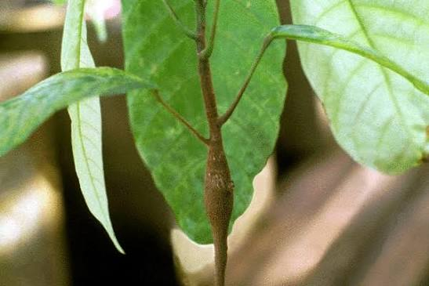{.moldura}
:::

::: {.column}
- Perdas severas de produção — reduz drasticamente o rendimento de amêndoas, com quedas que podem chegar a 25% já no primeiro ano de infecção e agravar-se progressivamente

- Morte das plantas — árvores infectadas frequentemente morrem em 2 a 3 anos após o aparecimento dos sintomas

- Sintomas de inchaço (swelling) — dilatação característica de ramos, brotos e raízes, que dá nome à doença
:::
:::

## Objetivo do Trabalho

::: {.destaque}
Caracterizar a diversidade viral associada ao *Theobroma cacao* a partir de bibliotecas públicas e dados  amostrais, explorando a presença, distribuição e características dos resultados.
:::

## Etapas do Trabalho

::: {.cartoes}
::: {.cartao}
#### 1. Dados Públicos
Metatranscriptomas e metagenomas de *T. cacao* para identificação de vírus
:::
::: {.cartao}
#### 2. Processamento
Classificar taxonomia, variantes, ocorrência e novas espécies dos vírus identificados
:::

::: {.cartao style="--cor: #07aa0f"}
#### 3. Desenvolvimento
Desenvolvimento de ferramentas e pipelines de suporte para detecção e identificação.
:::
::: {.cartao style="--cor: #d81010"}
#### 4. Modelo e Validação
Criação de modelo de *Machine Learning* e validação experimental de sequências encontradas
:::
:::


## Desenvolvimento da Versão 3.0

::: {.columns}
::: {.column width="33%"}
::: {.numero}
### 2 Milhões
linhas modificadas
:::
:::

::: {.column width="33%"}
::: {.numero}
### 121
commits no repositório
:::
:::

::: {.column width="33%"}
::: {.numero}
### 4 Meses
desenvolvimento
:::
:::
:::

{fig-align="center"}

:::{.destaque-forte}
A nova versão da pipeline conta com novos recursos visuais e com maior controle de qualidade das sequências virais analisadas.   
:::

## O que há de novo

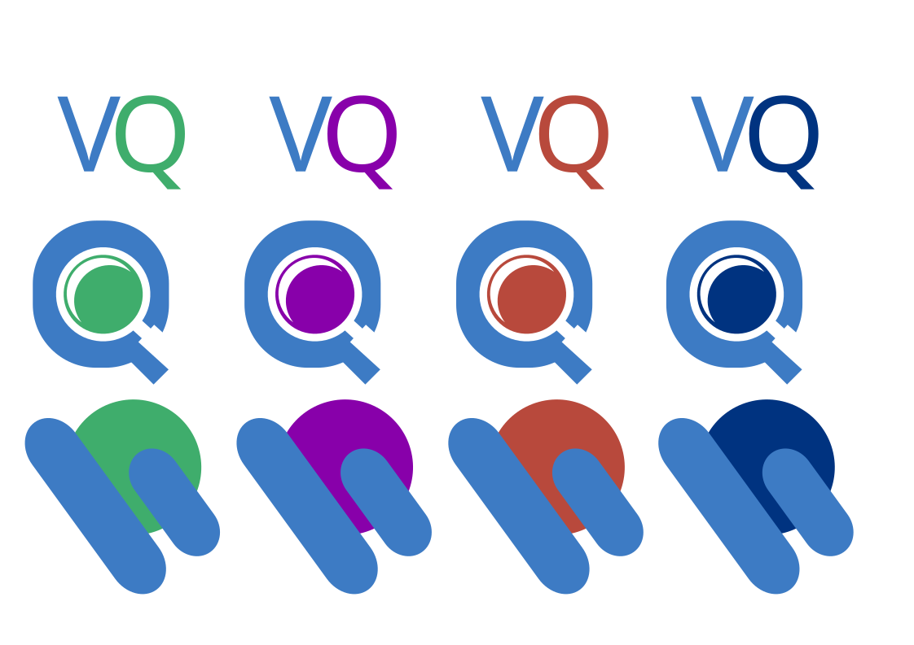{fig-align="center"}

## Reads também são analisadas

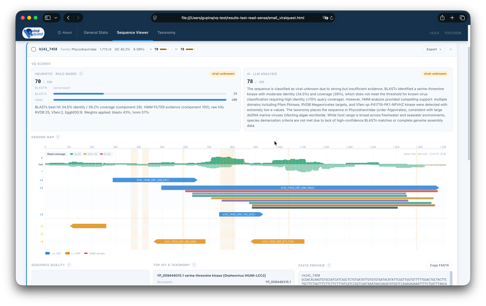{fig-align="center"}

## Análise de clusters 

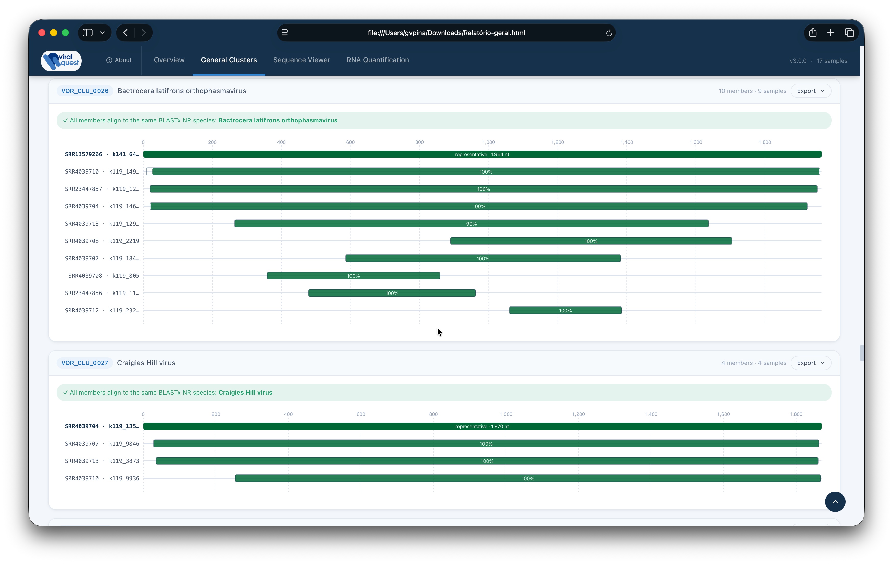{fig-align="center"}

## Uso da ferramenta

```bash
viralquest 
  --input         SAMPLE.fasta \              # arquivo fasta montado
  --outdir        SAMPLE_output \             # saída do arquivo
  --nr-db         path/to/nr.dmnd \           # BLASTx local
  --blastn_online user@email.com \            # e-mail do NCBI
  --transcriptome host_transcriptome.fasta \  # transcriptoma de ref.
  --reads         R1.fastq R2.fastq \         # reads brutas
  --read-type     sr \                        # small-reads
  --hk-genes      housekeeping_ids.txt \      # genes de ref.
  --model-type    ollama \                    # IA local
  --model-name    qwen3:12b \                 # nome do modelo local
  --llm-tokens    low \                       # modo da LLM
  -cpu            8                           # num de CPUs
  --live                                      # rich live display
```

::: {.legenda}
Executando pipeline diretamente do terminal.
:::

## Workflow

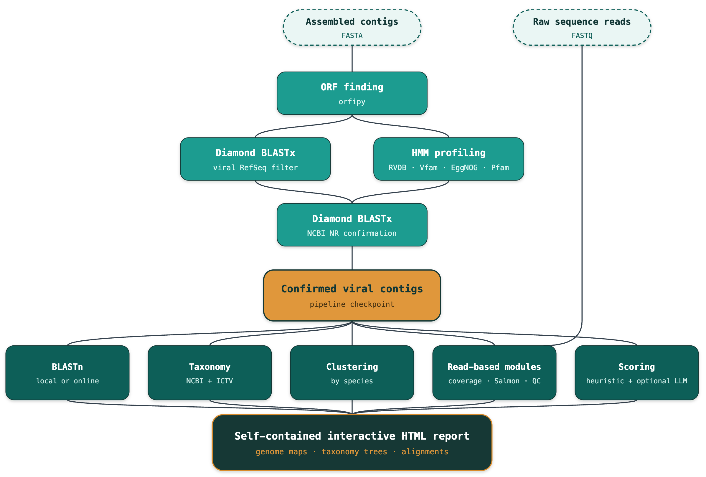{fig-align="center"}

## Execução no terminal

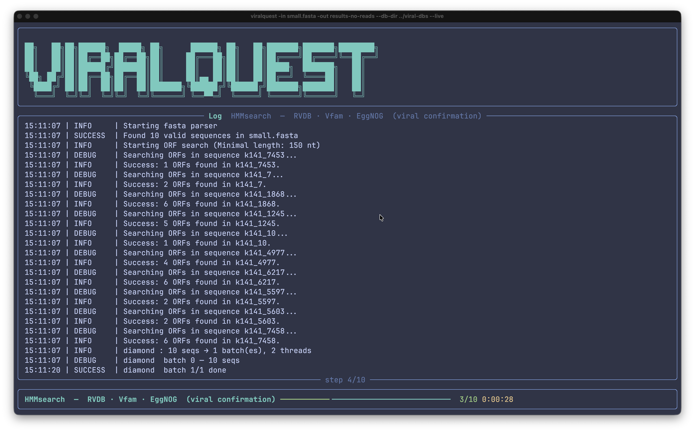{fig-align="center"}

# Ferramentas complementares {.divisor background-color="#304ea1"}

## Viralfetch

{fig-align="center"}

:::{.destaque}
Viralfetch é uma ferramenta CLI de obtenção de dados e metadados virais através do NCBI e ICTV. Querys podem ser feitas diretamente no terminal para acessar taxonomia, metadados, genbank, textos e árvores filogenéticas.
:::


:::

## Taxonomia sem sair do terminal {.smaller}

::: {.columns}
::: {.column width="50%"}
[tax]{.rotulo} — linhagem completa, de reino a espécie

```bash
viralfetch tax Coronaviridae
```

Busca insensível a maiúsculas, com sugestões de "você quis dizer" quando
erra por pouco.

::: {.caixa}
`--ncbi` consulta a taxonomia do **NCBI** em vez do VMR: serve para nomes
que o VMR não carrega — hospedeiro não viral, táxon recente, sinônimo.
:::
:::

::: {.column width="50%"}
[members]{.rotulo} — táxons abaixo de um dado táxon

```bash
viralfetch members Coronaviridae --rank genus
viralfetch members Riboviria --rank family --count
viralfetch members Coronaviridae --tree
```

Sem flags, mostra a contagem por rank; com `--tree`, a hierarquia inteira
de descendentes.
:::
:::

::: {.destaque .ambar}
`tax --compare-ncbi` põe as linhagens **ICTV e NCBI lado a lado** e realça as
divergências. Elas são esperadas — o NCBI costuma ficar atrás do ICTV — e são
justamente o objetivo do comando.
:::

## Sequências e literatura {.smaller}

::: {.columns}
::: {.column width="50%"}
[seq]{.rotulo} — dados do NCBI

Os acessos são resolvidos **localmente** pelo VMR; só então o NCBI é
consultado.

| Flag | Busca |
|:--|:--|
| `--meta` | metadados (~1 kB por acesso) |
| `--fasta` | sequências |
| `--gb` | registros GenBank completos |

Com `--taxon`, `--meta` mostra um **agregado local, sem rede** — espécies,
isolados, acessos e RefSeq — para você decidir se vale baixar.
:::

::: {.column width="50%"}
[text]{.rotulo} — capítulo do ICTV Report

```bash
viralfetch text Coronaviridae --images
viralfetch text Geminiviridae --raw > gemini.md
```

Converte o capítulo da família para Markdown preservando títulos, tabelas e
o **itálico dos nomes científicos**. Conteúdo em CC BY 4.0.

::: {.caixa}
Gênero ou espécie caem no capítulo da **família** — o Report é organizado
por família. Nome ausente do VMR é procurado no NCBI antes de desistir.
:::
:::
:::

::: {.destaque .vermelho}
Comandos que acessam o NCBI exigem um e-mail real, por política do próprio
NCBI. Não há padrão: `viralfetch config --store-ncbi-email voce@exemplo.br`
:::

## Filogenia e uso diário {.smaller}

::: {.cartoes}
::: {.cartao}
#### tree
Árvore da família como cladograma indentado. As árvores vêm **empacotadas**
(Newick + tabela ponta→vírus), então funciona offline.

Espécie realça a própria ponta; gênero, o clado inteiro.

`--tree N` · `--newick` · `--chapter`
:::

::: {.cartao}
#### msa
O alinhamento por trás da árvore, colorido por resíduo e quebrado em blocos
com régua de colunas.

Como são milhares de colunas, abre numa janela que cabe no terminal.

`--range A:B` · `--consensus` · `--fasta`
:::

::: {.cartao}
#### utilitários
`config` — e-mail, chave, caminhos
`cache info` / `cache clear`
`diagnose` — qualidade do parser
`update` — há VMR mais novo?
`--install-completion`
:::
:::

::: {.columns}
::: {.column width="55%"}
::: {.destaque}
`--json` em **qualquer** comando produz saída limpa, pronta para o `jq`.
As cores somem sozinhas quando a saída não é um terminal.
:::
:::

::: {.column width="45%"}
::: {.caixa .grafite}
**Códigos de saída**

`1` não encontrado · `2` uso incorreto
`3` falta e-mail NCBI · `4` falha no NCBI
:::
:::
:::

## Uso - Taxonomia Viral

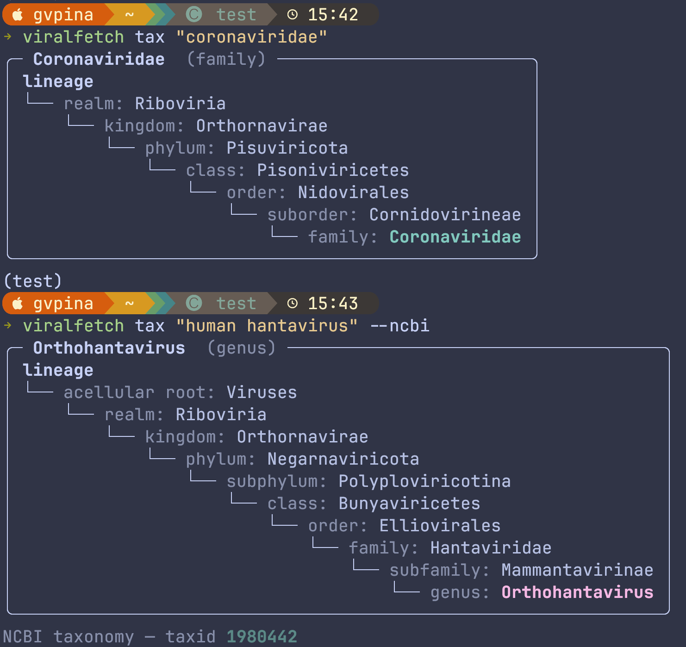{fig-align="center"}

::: {.legenda}
Taxonomia comparada entre ICTV e NCBI
:::

## Uso - Capítulos do ICTV

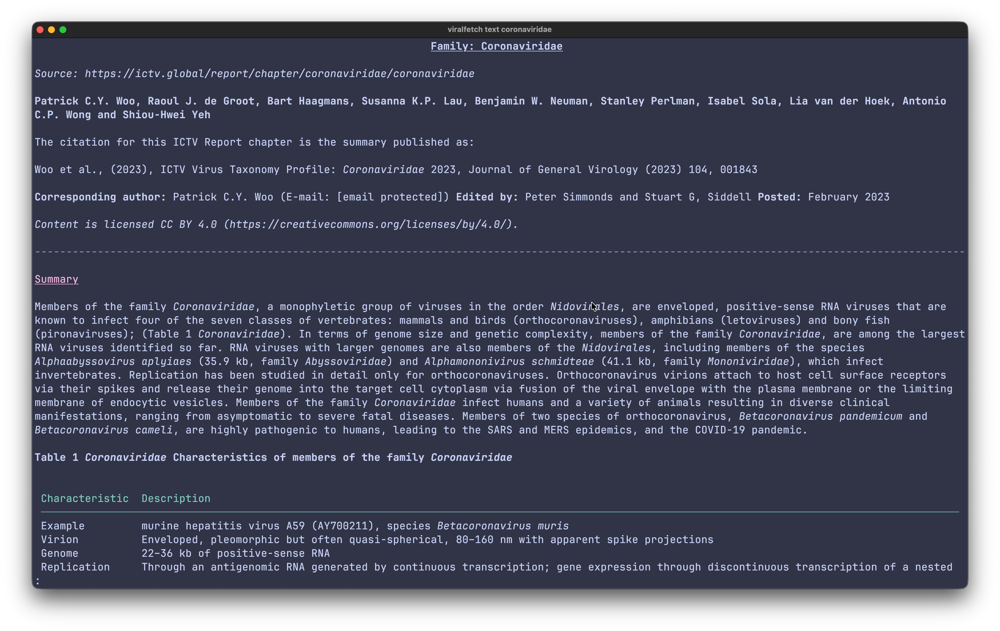{fig-align="center"}

## Uso - Árvores Filogenéticas

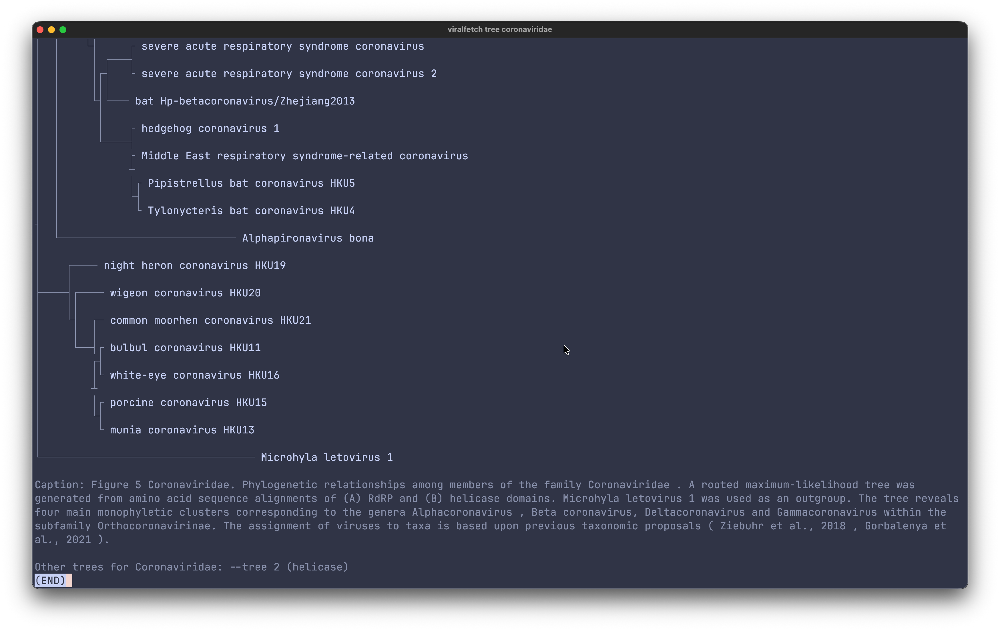{fig-align="center"}

## Instalação

{fig-align="center"}

::: {.cartoes}
::: {.cartao}
### Instalação
Via **PyPI** através do comando `pip install viralfetch` 
:::
:::


# Colaborações {.divisor background-color="#304ea1"}

## *Brevipalpus* spp.


::: {.columns}

::: {.column}
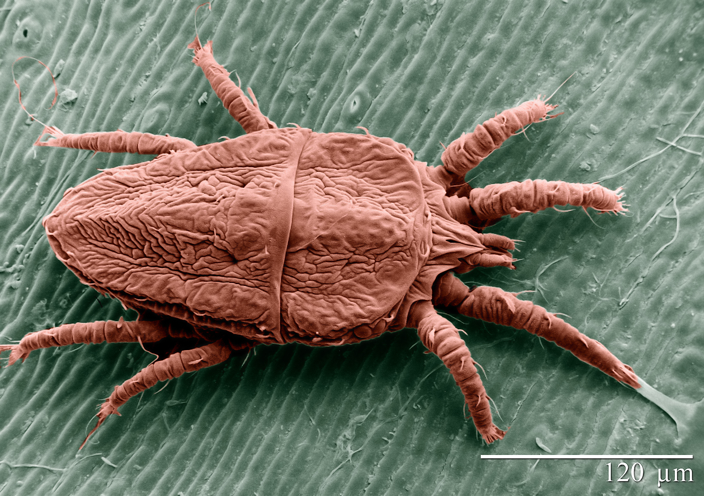{.moldura}

::: {.destaque}
Amostras de *Brevipalpus* spp. de diversas regiões do globo.
:::

:::
::: {.column}

[Projeto de Viroma Global do Gênero Brevipalpus]{.rotulo}

- Mais de 50 amostras sequenciadas de ácaros;

- Amostras de diferentes continentes;

- Amostras sob diferentes condições;

- Daniel Gonzalez Ibeas

:::
:::

## Resultados Parciais

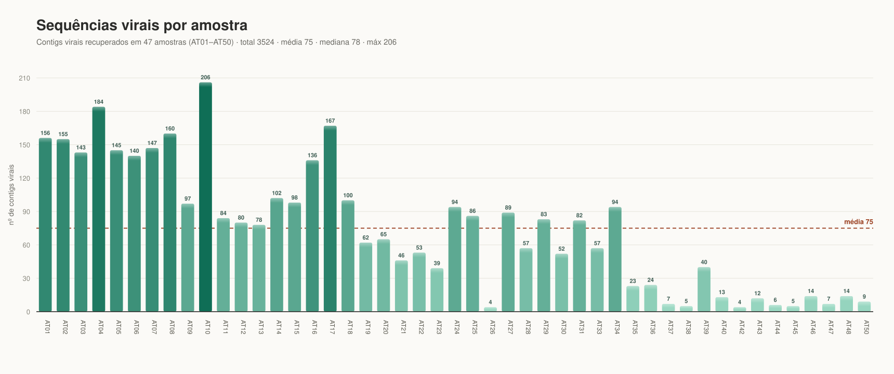{fig-align="center"}

## Taxonomia Geral


::: {.columns}
::: {.column width="33%"}
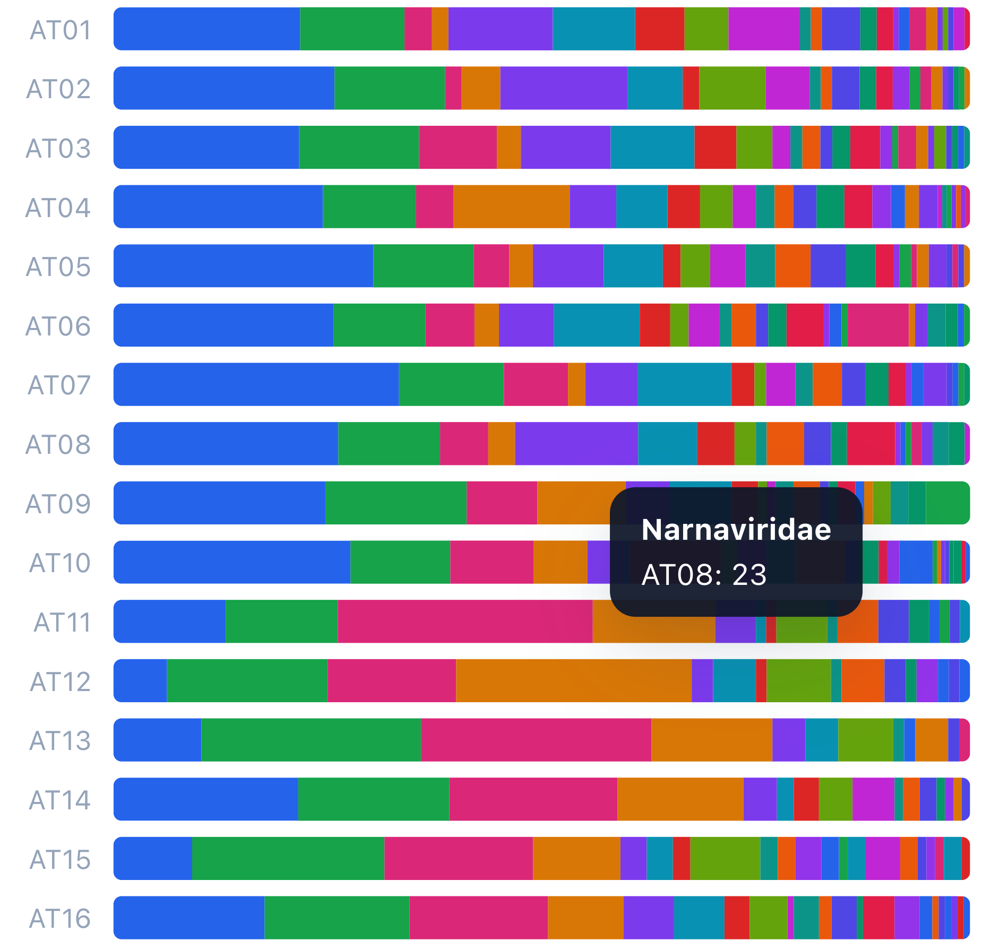
:::
::: {.column width="33%"}
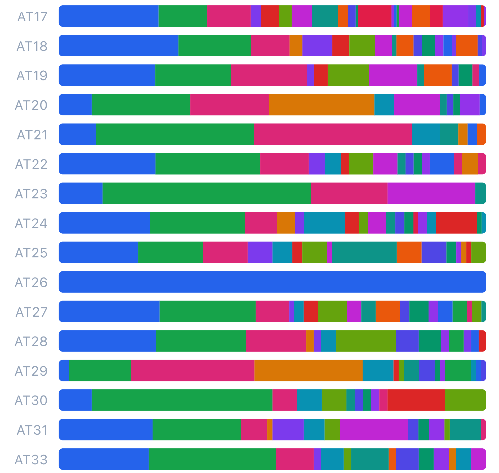
:::
::: {.column width="33%"}
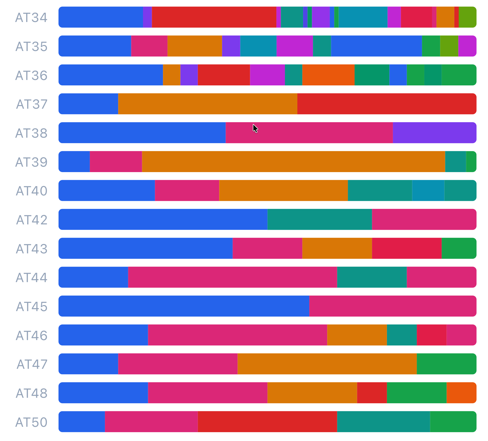
:::
:::

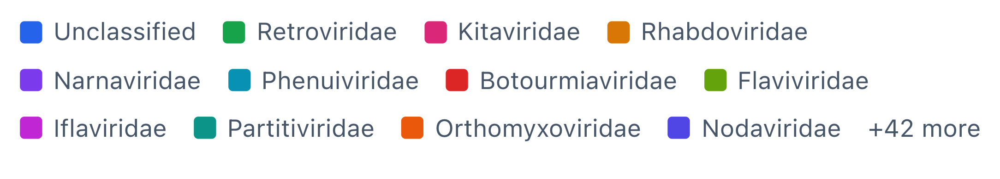


## Apoio {.smaller}

- Agências de fomento: FAPESB
- UESC e PPGGBM
- Participação de colegas

::: {.legenda}
Contato: gvpina.rodrigues@gmail.com · github.com/gabrielvpina
:::

<!--
  SLIDE FINAL — A EQUIPE

  FOTOS: montadas AUTOMATICAMENTE a partir de assets/members/. Cada subpasta
  (professor, researcher, phd, master, undergraduate) vira uma faixa. Para
  incluir alguém, largue a foto na subpasta certa; para remover, apague o
  arquivo. Nada aqui precisa ser editado — subpasta vazia não aparece.
  Títulos e ordem dos grupos ficam em _quarto.yml, chave `equipe:`.

  NOMES: a lista abaixo é independente das fotos. Um "- " por pessoa;
  as três colunas se reequilibram sozinhas. Use **negrito** para destacar
  a coordenação.
-->

## A equipe {.equipe-completa}



::: {.nomes}
- **Eric Roberto Guimarães Rocha Aguiar**
- Aijalon Brito da Silva Junior
- Amanda Gabrielly Santana Silva
- Anderson Carvalho Vieira
- Brenaráise Freitas Martins dos Santos
- Brunno Santos Mosquito de Souza
- Carlos Henrique de Carvalho Neto
- David Gabriel do Nascimento Souza
- David Willian Oliveira do Santos
- Evelyn dos Santos Silva
- Gabriel Victor Pina Rodrigues
- Giulia Verpa Narciso Ribeiro
- Henrique Andrade Rabelo Bomfim
- Hermanna Vanesca Viana de Oliveira
- Jessica Fernandes Padre
- Joannan Lima Silva
- João Pedro Nunes Santos
- Joel Augusto Moura Porto
- Jonatha dos Santos Silva
- Laiana Pinheiro de Lima
- Lara Beatriz C. Moreira de Vasconcelos
- Leyla Katiuska Martel Solis
- Lixsy Celeste Bernardez Orellana
- Lucas Barbosa de Amorim Conceição
- Lucas Diego Mota Meneses
- Lucas Yago Melo Ferreira
- Paula Luize Camargos Fonseca
- Sabrina Ferreira de Santana
- Tatyana Chagas Moura
:::
